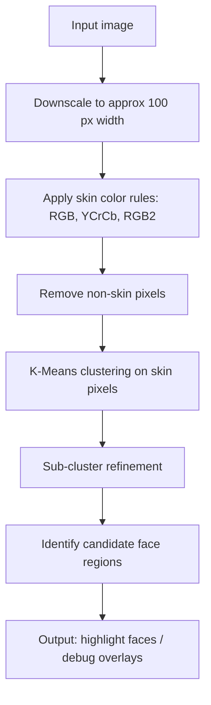

# AI-FaceDetection (Nov 2008)

This project was developed as part of an Artificial Intelligence course in November 2008 during college at the Tec de Monterrey, Campus Queretaro.

It aimed to explore AI algorithms for face detection in images and optimize them to run within the constrained resources of the **BlackBerry Pearl** device of that era. 

Traditional algorithms requiring extensive processing power and memory—as found on laptops or desktops—could not be used. That limitation compelled the development of a brand-new algorithm designed to detect faces efficiently, using minimal CPU and memory, and capable of recognizing faces in less than a second on the BlackBerry Pearl.

---

## Application Metadata

- **MIDlet-Version:** 0.8b  
- **MIDlet-Name:** FaceDetection  
- **MIDlet-Description:** Mobile application for automatic face detection in images  

---

## BlackBerry Pearl (circa 2006–2008) Specifications

- **CPU:** 32-bit Intel XScale PXA272 at 312 MHz  
- **RAM:** 32 MB (some models up to 64 MB)  
- **Storage:** 64 MB internal + microSD expansion  
- **Screen:** ~2.2" TFT LCD, 240×260 px resolution (~161 ppi), 65K colors  
- **Camera:** 1.3 MP (8100) or 2.0 MP (8110/8120 models) with LED flash
- **Battery:** ~900 mAh (Li-Ion), ~3.5 h talk time / ~360 h standby
- **Connectivity:** Bluetooth 2.0; no Wi-Fi (in earliest models) 
- **Weight & Size:** ~90 g, 107 × 50 × 14 mm  

These specs illustrate the highly limited computational and memory environment available at the time, which is why existing desktop-class face detection methods were not feasible.

---

## Project Structure

- **MainApp.java** – Entry point that initializes the user interface.  
- **ColorKMeansDetectorScreen.java** – Handles image loading and delegates detection tasks.  
- **FaceDetector.java** – Contains the custom face detection algorithm optimized for performance.

---

## Main Flow

1. **MainApp** initializes the application and displays the main UI screen via **ColorKMeansDetectorScreen**.  
2. **ColorKMeansDetectorScreen** handles image input and passes the data to **FaceDetector**.  
3. **FaceDetector** runs the optimized algorithm to detect faces, returning results in well under one second.

---

## Notes & Considerations

- Designed for **J2ME/MIDP** environment, compatible with early mobile platforms.  
- Prioritized careful balancing of **performance**, **memory efficiency**, and **accuracy**, tailored to very limited hardware.

---

## Summary of Algorithm & Innovation

At the time (2008), most face detection techniques (e.g., Viola–Jones Haar cascades) were too computationally heavy for mobile devices. They required desktop-class CPUs and far more memory than what the **BlackBerry Pearl** offered (312 MHz ARM CPU, 32 MB RAM).  

To make on-device face detection possible, I designed a **lightweight hybrid algorithm** that combined color-based filtering with unsupervised clustering. This approach was tailored to run in **sub-second time** while consuming minimal CPU and memory.

### Core Innovations

1. **Aggressive Downscaling**  
   Images were reduced to ~100 px width, preserving overall structure while drastically reducing the number of pixels to process.

2. **Multi-Rule Skin Detection**  
   - **RGB rule** (Peer–Kovac–Solina, 2003) to identify natural skin-tone thresholds.  
   - **YCrCb rule** (Chai–Ngan) to exploit chrominance values, using a lightweight RGB→YCrCb conversion tuned for speed.  
   - **RGB2 heuristic** (r > g > b, g > b) as a fallback rule for ultra-fast checks.  
   These rules acted as a **pre-filter**, discarding non-skin pixels early and shrinking the candidate search space.

3. **Spatial K-Means Clustering**  
   Remaining skin pixels were clustered based on their **(x, y) positions**, not color. With K=3, this produced contiguous “blobs” of skin-like regions—potential faces.

4. **Hierarchical Refinement**  
   Each cluster was further segmented into **sub-clusters (SUB_K)** to isolate actual faces from noise (e.g., background with similar tones).

5. **On-Device Debugging Pipeline**  
   Intermediate results (skin masks, clustered images) were drawn into **bitmap overlays** and saved as PNGs, enabling visual feedback directly on device without heavy tooling.

---

## Algorithm Flow

### Why This Was Novel in 2008
- **On-device face detection was almost unheard of**. Mobile AI was in its infancy; even basic image processing was considered heavy.
- The **BlackBerry Pearl** had no GPU acceleration, only a 312 MHz ARM CPU and 32 MB RAM, making real-time detection a huge technical challenge.
- By combining **color filtering + lightweight clustering**, this approach sidestepped heavy statistical classifiers or neural nets, enabling **sub-second detection** on a constrained mobile device.
- It represents one of the earliest demonstrations of **real-time face detection on consumer phones**, paving the way for later mobile AI applications.

